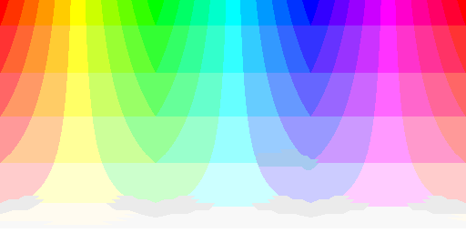
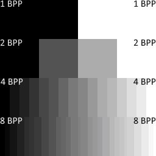
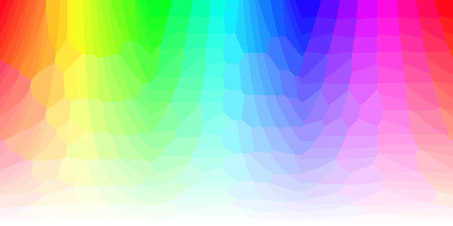
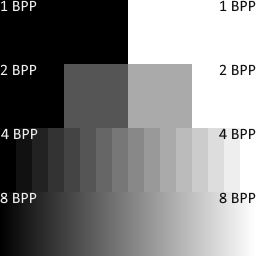
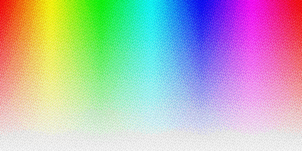
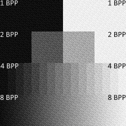
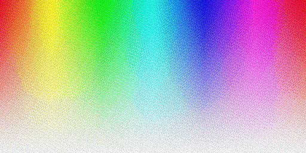
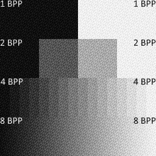
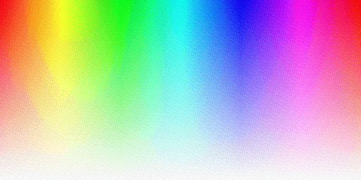
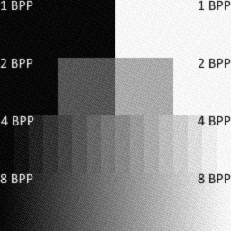

### Dither images using interleaved gradient noise
# IGN-PY

This is an experimental image converter using interleaved gradient noise dithering for color debanding.
Converts images to 8-bit PNG format.

## Disclaimer
This script was made with assistance of Claude.ai: As a developer, I understand the code and I'm able to review it properly. Claude was used as an assistant to speed up development. I did **no** intensive testing on the script. So, be aware of the bugs.

## Requirements:
- Python 3.7+  
- pillow
- numpy
- ImageMagick

#### Install ImageMagick:

**Windows**: Download from [imagemagick.org](https://imagemagick.org/)  
**Linux**: `sudo apt install imagemagick`  
**macOS**: `brew install imagemagick`  

```
pip install pillow numpy
```
## Usage:
  ### Single image:
    python ign_converter.py /path/to/image.jpg 
    python ign_converter.py /path/to/image.webp -o /path/to/output/

  ### Batch conversion:
    python ign_converter.py -d /path/to/images/ -o /path/to/converted-images/

  ### With custom noise settings:
    python ign_converter.py /path/to/image.jpg -b 4 -s 0.005

### Flags
| Switch | Value Type | Description |
|-----------|----------|----------|
| `-d` | string | Input directory (for batch conversion) |
| `-o` | string | Output directory (required for batch conversion) |
| `-n` | int | Noise scale/coarseness in pixels (default: 1, range: 1-8) |
| `-s` | float | Noise strength (default: 0.005, recommended: 0.001-0.01) |
| `-b` `--blur` | float | Gaussian blur radius for final image (default: 0.0, range: 0.0-16.0) |
| `-m` `--md5filename` |  | Use MD5 hash of the final image as filename |
| `-p` `--palette`| `adaptive` `system`| Palette mode: adaptive (default) or system (Windows 256-color palette) |
| `-r` `--range-normalize` | | Normalizes image color range before dithering; Can help with some 32-Bit images |


## Examples

| RGB Image | GS Image | Flags | Comment |
|-----------|----------|-------|---------|
|  130305 Colors, 259kb |  255 Colors, 9.85kb | | unprocessed original images |
|  95 Colors, 3.10kb |  29 Colors, 4.76kb | -s 0.0 -b 0.0 -p system | no dithering, system palette |
|  256 Colors, 12.7kb |  255 Colors, 5.87kb | -s 0.0 -b 0.0 -p adaptive | no dithering, adaptive color palette |
|  163 Colors, 42.8kb |  29 Colors, 25.0kb | -s 0.25 -b 0.0 -p system | ign dithering (very high value), system color palette |
|  256 Colors, 96.9kb |  256 Colors, 35.5kb | -s 0.25 -b 0.0 -p adaptive | ign dithering (very high value), adaptive color palette |
|  45300 Colors, 220kb |  256 Colors, 31.9kb | -s 0.125 -b 0.5 -p adaptive | ign dithering (moderate value), adaptive color palette, 0.5px gaussian blur |
|  56333 Colors, 63.7kb |  253 Colors, 15.7kb | -s 0.05 -b 1.5 -p adaptive | ign dithering, adaptive color palette, 1.5px gaussian blur |

Color count by `magick <image> -format "%k\n" info:`

## Limitations

- Always converts RGBA to RGB by compositing on white background
- Tested on Windows 11 only

## Would You Like To Know More?

### Interleaved Gradient Noise (IGN)

Interleaved gradient noise is based on Jorge Jimenez's formula from [Next Generation Post Processing in Call of Duty](https://www.iryoku.com/next-generation-post-processing-in-call-of-duty-advanced-warfare/)  
```
frac(52.9829189 * frac(0.06711056 * x + 0.00583715 * y))
```

### Color Palettes

The scripts "system" palette is based on [SystemDefault8BppPalette](https://docs.kgysoft.net/drawing/html/M_KGySoft_Drawing_Imaging_PredefinedColorsQuantizer_SystemDefault8BppPalette.htm). That's basically the classic Windows system palette - the 256-color palette that Windows used in 256-color mode. It's well-documented, reproducible.  

### Resources

- https://blog.demofox.org/2022/01/01/interleaved-gradient-noise-a-different-kind-of-low-discrepancy-sequence/

- https://docs.kgysoft.net/drawing/html/T_KGySoft_Drawing_Imaging_InterleavedGradientNoiseDitherer.htm

- Original images ([media/GrayShades.gif](https://docs.kgysoft.net/drawing/Help/Images/media/GrayShades.gif), [media/AlphaGradient.png](https://docs.kgysoft.net/drawing/Help/Images/media/AlphaGradient.png)) taken from [docs.kgysoft.net](https://docs.kgysoft.net/drawing/html/T_KGySoft_Drawing_Imaging_InterleavedGradientNoiseDitherer.htm). See licence on *non software-like materials*: https://github.com/koszeggy/KGySoft.Drawing?tab=License-1-ov-file#readme